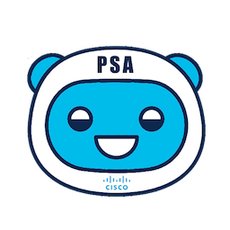

# se-post-sales-assistant

*Post Sales Assistant is a Webex Teams bot tailor-made for SE's to provide them with a personal assistant focused on the post sales portion of the customer lifecycle journey*

## Business/Technical Challenge

As Systems Engineers in the Americas, we understand that our relationship with our customers extends beyond the close of a deal. We have a role to play in the customer's journey with our solutions - all the way from pre sales through post sales. While we do our best to keep up with customers after a sale, checking up on customers after a sale can be a difficult but worthwhile effort. 

Once equipment and solutions are received, a key question arises as to whether or not the customer is even using all that we provided to them. In addition, as trusted advisors our customers reach out to us when situations arise because they believe we as Cisco engineers can facilitate resolution.

In other words, timely responses from SE's with regards to post sales engagements ensures a world class experience for our customers!

## Proposed Solution

Our solution to this challenge is a personal assistant available to any and all SE's: Post Sales Assistant (PSA). 
Post Sales Assistant is a Webex Teams Bot with integrations into Outlook to set reminders for follow ups and into the TAC case management backend for information regarding any service requests.

On the proactive front, a SE can use PSA to schedule a reminder for themself that will appear in Outlook with information regarding the customer and situation to be followed up on. This facilitates the process of remembering to reach out and engage with a customer regarding whether or not their solutions are in place and if they are realizing the value of choosing Cisco.

On the reactive front, the bot can be used to pull pertinent information regarding a customer's TAC case such as its status, severity, last modified date, engineer assigned, etc. Furthermore, a SE is able to immediately open the case for detailed reading as well as generate an email template to the escalation team and/or the engineer assigned as needed.

## Cisco Products Technologies/ Services

Our solution will levegerage the following Cisco technologies

* [Webex Teams](http://cisco.com/go/webexteams)
* [Microsoft Outlook](https://www.microsoft.com/en-us/microsoft-365/outlook/outlook-for-business)
* Cisco TAC Case Backend

## Team Members

* Bradford Ingersoll <bingerso@cisco.com> - U.S. Commercial East
* Eric Scott <eriscott@cisco.com> - U.S. Public Sector East

## Solution Components

Our solution uses the following:
* [Python 3.8](http://python.org/)
* [webexteamsbot Python Module](https://github.com/hpreston/webexteamsbot)
* [Microsoft Graph API](https://developer.microsoft.com/en-us/graph)
* Cisco TAC Case Backend API

## Usage

Being a Webex Teams bot, using SE Post Sales Assistant simply requires a SE to start a 1:1 converstation with PSA and begin using it!

## Installation

This bot is expected to be hosted internally within Cisco as a tool for SE's. No installation required.

## Documentation

* [webexteamsbot Python Module](https://github.com/hpreston/webexteamsbot)
* [Microsoft Graph API - Calendar Event](https://docs.microsoft.com/en-us/graph/api/calendar-post-events?view=graph-rest-1.0&tabs=http)

## License

Provided under Cisco Sample Code License, for details see [LICENSE](./LICENSE.md)

## Code of Conduct

Our code of conduct is available [here](./CODE_OF_CONDUCT.md)

## Contributing

See our contributing guidelines [here](./CONTRIBUTING.md)
